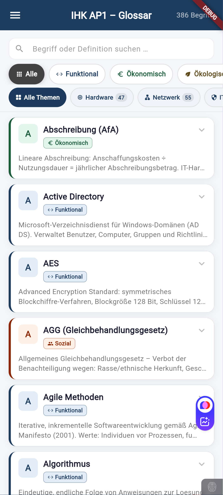
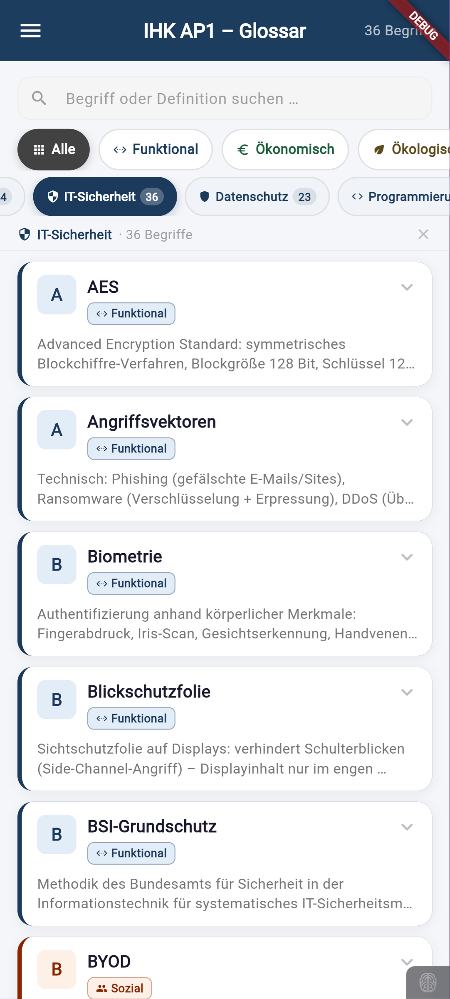
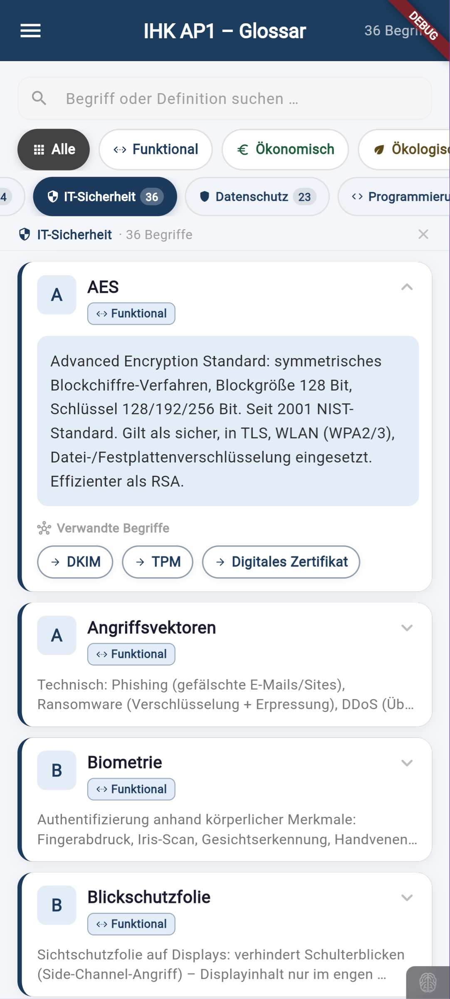

# AP1 Glossar – IHK Prüfungsvorbereitung

> **386 Fachbegriffe** · **817 Tags** · **4 IHK-Bewertungsaspekte** · **Themen-Filter**  
> Die umfassendste Glossar-App für die IHK Abschlussprüfung Teil 1 – Fachinformatiker (FIAE/FISI), IT-Systemkaufleute & Kaufleute für Digitalisierungsmanagement.

**🔗 Live-App:** [iwilfried.github.io/ap1-glossar](https://iwilfried.github.io/ap1-glossar/)

---

## Warum dieses Glossar?

Die AP1-Prüfung verlangt sicheres Wissen über hunderte IT-Fachbegriffe – und deren Einordnung in die vier IHK-Bewertungsaspekte. Dieses Glossar ist kein Wikipedia-Klon: Jeder Begriff ist **prüfungsrelevant aufbereitet**, nach **Bewertungsaspekten farbkodiert** und **thematisch filterbar**.

### Features

- **386 Fachbegriffe** aus allen AP1-relevanten Themengebieten
- **817 Tags** für präzise Zuordnung und Cross-Referenzen
- **Bewertungsaspekt-Filter** – Funktional · Ökonomisch · Ökologisch · Sozial
- **Themen-Filter** – Hardware · Netzwerk · Sicherheit · Software · Projektmanagement u.v.m.
- **Volltextsuche** über Begriffe und Definitionen
- **Offline-fähig** – kein Login, kein Server, sofort nutzbar
- **Responsive** – optimiert für Desktop, Tablet und Smartphone

---

## Bewertungsaspekte

Die 4+1 IHK-Bewertungsaspekte sind das Rückgrat jeder AP1-Prüfungsaufgabe. Das Glossar ordnet jeden Begriff dem passenden Aspekt zu:

| Aspekt | Farbe | Prüfungsrelevanz |
| --- | --- | --- |
| **Funktional** | 🔵 Blau | Technische Eignung, Leistung, Protokolle, Architektur |
| **Ökonomisch** | 🟢 Grün | TCO, ROI, Kosten-Nutzen, AfA, Lizenzmodelle |
| **Ökologisch** | 🟤 Braun | Energieeffizienz, CO₂, Recycling, Green IT |
| **Sozial** | 🟠 Orange | Ergonomie, Barrierefreiheit, DSGVO, Arbeitsschutz |
| **Berechnung** | 🟣 Violett | Formeln, Kalkulationen, Umrechnungen (AfA, MwSt, Subnetting) |

---

## Screenshots

<p align="center">
  
  
  
</p>

<p align="center">
  <em>Startseite · Aspekt-Filter · Themen-Filter</em>
</p>

---

## Themengebiete

Die Begriffe decken alle prüfungsrelevanten AP1-Bereiche ab:

| Thema | Anzahl | Beispiele |
| --- | --- | --- |
| Netzwerk | 44 | TCP/IP, DNS, VLAN, Subnetting, VPN |
| Hardware | 35 | RAID, SSD, CPU-Architektur, USV |
| Sicherheit | — | CIA-Triade, AES, Firewall, BSI-Grundschutz |
| Software | — | Compiler, IDE, Versionskontrolle, Agile Methoden |
| Ökonomie | — | AfA, TCO, Break-Even, Nutzwertanalyse |
| Recht & Datenschutz | — | DSGVO, BDSG, AGG, Urheberrecht |

*Die Verteilung über weitere Themen wird kontinuierlich erweitert.*

---

## Technologie

| Komponente | Technologie |
| --- | --- |
| Framework | Flutter 3.29 |
| Sprache | Dart 3 |
| Plattformen | Web · Android · iOS |
| Daten | Hardcoded `lib/data/data.dart` (offline-first) |
| Schriftart | Google Fonts (Poppins) |
| Deployment | GitHub Pages |
| Releases | 19 Releases · [Changelog →](https://github.com/iwilfried/ap1-glossar/releases) |

---

## Lokale Entwicklung

### Voraussetzungen

- Flutter SDK ≥ 3.0 ([flutter.dev](https://flutter.dev))
- Dart SDK ≥ 3.0

### Setup

```bash
git clone https://github.com/iwilfried/ap1-glossar.git
cd ap1-glossar
flutter pub get
flutter run -d chrome          # Web (lokal)
flutter run                    # Android/iOS
flutter build web --release    # Production Build
```

---

## Begriffe hinzufügen / bearbeiten

Alle Begriffe, Aspekt-Zuordnungen und Themen-Tags liegen in:

```
lib/data/data.dart
```

**Neuen Begriff ergänzen:**

```dart
// In glossaryTerms Map:
'Neuer Begriff': 'Definition des Begriffs...',

// In termAspect Map:
'Neuer Begriff': 'Funktional',  // oder: Ökonomisch | Ökologisch | Sozial

// In termTags Map (optional):
'Neuer Begriff': ['Netzwerk', 'Sicherheit'],
```

---

## Roadmap

### ✅ v1.x – Glossar-Grundlage (aktuell)

- [x] 386 Fachbegriffe mit Definitionen
- [x] 4 IHK-Bewertungsaspekte mit Farbkodierung
- [x] Themen-Filter mit Anzahl-Badges
- [x] Volltextsuche
- [x] Responsive Web-App
- [x] 817 unique Tags

### 🔜 v2.0 – Lernmodus

- [ ] Karteikarten-Modus (Begriff → Definition aufdecken)
- [ ] Fortschritts-Tracking (gelernt / wiederholungsfällig / neu)
- [ ] Zufalls-Quiz aus gefilterten Begriffen
- [ ] Favoritenliste (lokaler Speicher)
- [ ] Deep-Links zu einzelnen Begriffen

### 🔮 v3.0 – AP2-Erweiterung & Cloud

- [ ] AP2-Begriffe ergänzen (Projektmanagement, FIAE/FISI-spezifisch)
- [ ] Filter: AP1 / AP2 / Alle
- [ ] Cloud-Sync mit Firestore (optional)
- [ ] Dozenten-Dashboard zum Hinzufügen neuer Begriffe

---

## Verwandte Projekte

| Projekt | Beschreibung |
| --- | --- |
| [ap1-notion-export](https://github.com/iwilfried/ap1-notion-export) | 100 Lernkarten als Notion 5-DB-Lernkartei mit schema.json |

---

## Datenquellen

- IHK-Prüfungen AP1, Frühjahr 2021 – Herbst 2025
- IHK-Prüfungskatalog für gestreckte Abschlussprüfungen IT-Berufe
- BSI-Grundschutz-Kompendium: [bsi.bund.de/grundschutz](https://www.bsi.bund.de/grundschutz)
- DSGVO – EUR-Lex: [Verordnung 2016/679](https://eur-lex.europa.eu/legal-content/DE/TXT/?uri=CELEX:32016R0679)
- [it-berufe-podcast.de](https://it-berufe-podcast.de) (Stefan Macke) – Prüfungsstatistiken

---

## Lizenz

MIT License – siehe [LICENSE](LICENSE)

Lernmaterialien für den persönlichen Prüfungsgebrauch.  
IHK-Prüfungsinhalte unterliegen dem Urheberrecht der zuständigen IHK-Gremien.

---

<p align="center">
  <strong>Made with 💙 in Düsseldorf</strong><br>
  <em>Von einem IT-Trainer, für angehende Fachinformatiker</em>
</p>
